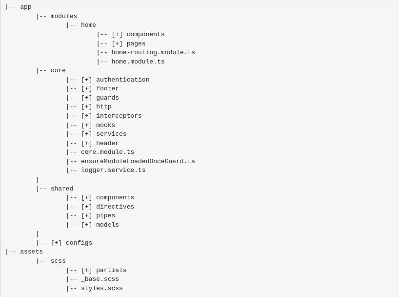

# README - Projeto Angular Pokémon TCG

Este é um projeto Angular desenvolvido com a versão 16+ do Angular e estilizado com Tailwind CSS utilizando o Visual Studio Code como ambiente de desenvolvimento.

## Visão Geral

O projeto consiste em uma aplicação que consulta a API do Pokémon TCG (Trading Card Game) disponível em [https://docs.pokemontcg.io/#api_v1cards_list](https://docs.pokemontcg.io/#api_v1cards_list), permitindo aos jogadores montar seus próprios baralhos de cartas.

## Funcionalidades

### Lista de Baralhos

- Os usuários podem visualizar uma lista de seus baralhos existentes.
- É possível criar novos baralhos.
- Os usuários podem remover baralhos existentes.
- A edição de baralhos também é suportada.
- Ao clicar em um baralho, é possível visualizar seus detalhes.

### Criação de Baralho

- Os usuários podem atribuir um nome ao seu baralho.
- É permitido adicionar cartas ao baralho.
- O baralho deve ter entre 24 e 60 cartas.
- Apenas até 4 cartas com o mesmo nome podem ser adicionadas ao baralho.
- Após a criação do baralho, a lista de baralhos é atualizada automaticamente.
- Os baralhos são armazenados apenas em memória.

### Detalhes do Baralho

- Os usuários podem visualizar quantos Pokémon e cartas de treinador existem no baralho (atributo 'supertype').
- É possível identificar quantas cores diferentes compõem o baralho e quantos tipos de cartas únicos estão presentes.

## Como Executar o Projeto

1. Clone este repositório.
2. Abra o projeto no Visual Studio Code.
3. Certifique-se de ter o Angular CLI instalado globalmente (`npm install -g @angular/cli`).
4. Execute `npm install` para instalar as dependências.
5. Execute `ng serve` para iniciar o servidor de desenvolvimento.
6. Navegue até `http://localhost:4200/` em seu navegador para visualizar o projeto.

## Configuração da API
Para acessar a API do Pokémon TCG, é necessário configurar uma chave de acesso. Esta chave é requerida para autenticar as solicitações à API. No entanto, por motivos de segurança, a chave de acesso não é incluída no repositório público. Você pode obter sua própria chave de acesso registrando-se em https://dev.pokemontcg.io/. Uma vez registrado, insira sua chave de acesso no arquivo environment.development.ts.

## Estratégia de Desenvolvimento
Este projeto foi desenvolvido como parte de uma demonstração da minha abordagem ao desenvolvimento de software. Devo ser transparente e admitir que, devido ao meu atual emprego e participação em múltiplos processos seletivos, meu tempo tem sido escasso e tive que fazer escolhas.

Optei por demonstrar minha organização de código e estrutura de projeto, em vez de priorizar a interface do usuário. Isso não implica que eu não aprecie ou não tenha habilidades com tecnologias como GRID, flexbox e animações - na verdade, eu gosto bastante!

O projeto é bastante simples.

Alguns pontos sobre minha forma de codar:

1. Sempre busco adotar as melhores práticas de programação. Para isso, divido o código em pequenas funções com uma única responsabilidade.

2. Tenho preferência por tipar tudo, o que facilita a manutenção e oferece uma melhor experiência com o autocomplete.

3. Evito inserir lógica diretamente nas views (HTML), optando por manter toda a lógica dentro dos componentes.

4. Se o método não é chamado fora do componente por padrão o defino como privado.

### Organização de Pastas
Este projeto Angular segue uma estrutura de pasta comum para facilitar a organização e manutenção do código-fonte. 

Pages - Contém todas as páginas relacionadas a um determinado domínio de negócios. No entanto, devido à simplicidade deste projeto, as páginas estão diretamente localizadas na pasta "app".

Services - Dedicado à organização de serviços, que são responsáveis por fornecer funcionalidades específicas para diferentes partes da aplicação.

Shared - Contém componentes, serviços, diretivas, pipes e outros artefatos que são compartilhados entre várias partes da aplicação.

Para projetos mais complexos normalmente sigo esse modelo:

## Contribuindo

Contribuições são bem-vindas! Sinta-se à vontade para enviar pull requests ou abrir issues para sugestões e melhorias.

## Autor

Este projeto foi desenvolvido por Matheus dos Santos da Silva.

## Licença

Este projeto está licenciado sob a [Licença MIT](https://opensource.org/licenses/MIT).
